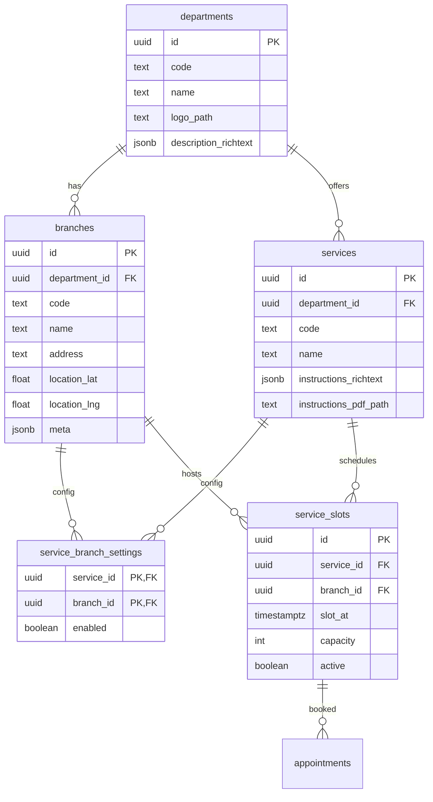

### Civigo‑Gov — Branches, Department Logos/Descriptions, and Service Instructions (SSR + RLS Plan)

Last updated: 2025‑08‑15

### Current state snapshot (grounded in repo)

- **DB core tables**: `public.departments(id, code, name)`, `public.services(id, department_id, code, name)`, `public.officer_assignments(officer_id, department_id, active)`, `public.appointments(...)`, `public.service_slots(service_id, slot_at, capacity, active, created_by, ...)`, `public.documents`, `public.appointment_documents`.
- **Policies (selected)**:
  - `departments` and `services`: RLS enabled; public read policies exist currently, but will be changed to authenticated-only per new requirement.
  - `service_slots`: RLS enabled; public/citizen read policy for active future slots; officer/admin policies scope by `services.department_id` via `officer_assignments`.
  - `profiles`, `appointments`, and others: RLS enabled; role/owner scoped.
- **RPC**: `book_appointment_slot(p_slot_id, p_citizen_id, p_notes)` is SECURITY DEFINER for atomic capacity booking.
- **Storage (existing)**: `nic-media` bucket with private policies (owner/admin access); no department/service assets yet.
- **Gov app SSR/auth**: Next.js App Router (SSR-first). Server client via `@supabase/ssr` in `getServerClient()`. Admin/officer areas gated in Server Components. Server Actions used for privileged writes. UI is shadcn/ui + Tailwind.

### Goals in this plan

- Add department logos (image) and rich descriptions.
- Introduce branches per department (name, address/location, meta).
- Make slots branch-scoped; manage services per branch (enabled/disabled).
- Add service instructions (rich text) + optional instructions.pdf upload.
- Maintain SSR-first access and strict RLS; no service-role in browser. Use signed URLs/Server Actions.

## Database design and migrations (proposed)

#### 1) New table: `branches`

- Columns:
  - `id uuid pk default gen_random_uuid()`
  - `department_id uuid not null references public.departments(id) on delete cascade`
  - `code text not null` (short, slug-like per department)
  - `name text not null`
  - `address text null`
  - `location_lat double precision null`, `location_lng double precision null`
  - `meta jsonb null`
  - `created_at timestamptz not null default now()`
- Constraints/Indexes:
  - `unique (department_id, code)`
  - `index idx_branches_department on branches(department_id)`
- RLS:
  - enable RLS
  - Public read (citizens can browse branches): `for select using (true)`
  - Admin all: `for all using (public.current_app_role()='admin') with check (public.current_app_role()='admin')`
  - Officer write in assigned departments only (insert/update/delete): `exists (select 1 from public.officer_assignments oa where oa.department_id = branches.department_id and oa.officer_id = auth.uid() and oa.active)`

#### 2) New table: `service_branch_settings`

- Purpose: per-branch service toggles (enabled/disabled) and future per-branch knobs.
- Columns:
  - `service_id uuid not null references public.services(id) on delete cascade`
  - `branch_id uuid not null references public.branches(id) on delete cascade`
  - `enabled boolean not null default true`
  - `created_at timestamptz not null default now()`
  - PK: `(service_id, branch_id)`
- Indexes:
  - `index idx_sbs_branch on service_branch_settings(branch_id)`
- RLS:
  - enable RLS
  - Public/citizen read OK for browse: `for select using (true)`
  - Admin all
  - Officer write restricted by department match on both `service.department_id` and `branch.department_id`.

#### 3) Change: `service_slots` become branch-scoped

- Add column: `branch_id uuid null references public.branches(id) on delete cascade` (two-step migration; see backfill below).
- Backfill: create a default `branches` row (e.g., code: `main`) per department, then set each slot’s `branch_id` by deriving from its `service_id` → `services.department_id` → that department’s default branch.
- Tighten constraints:
  - After backfill: `alter table service_slots alter column branch_id set not null`
  - New uniqueness: `unique (service_id, branch_id, slot_at)`
  - Indexes: `idx_service_slots_branch_id`, keep `service_id`/`slot_at` composites, and add `(service_id, branch_id, slot_at)` composite for range queries.
- RLS policy update (officers): ensure both the `services.department_id` and `branches.department_id` match and the officer is assigned + active.

#### 4) Change: `departments` add presentation fields

- Columns:
  - `logo_path text null` (storage path like `departments/{department_id}/logo.png`)
  - `description_richtext jsonb not null default '{}'::jsonb` (Tiptap JSON)
  - `description_updated_at timestamptz null`
- RLS: existing public select continues; officers/admins can update in assigned departments per existing `services`-like policies or add explicit policies if needed for `departments` updates (admin full; officer update only where assigned via `officer_assignments`).

#### 5) Change: `services` add instruction fields

- Columns:
  - `instructions_richtext jsonb not null default '{}'::jsonb` (Tiptap JSON)
  - `instructions_pdf_path text null` (storage path `services/{service_id}/instructions.pdf`)
  - `instructions_updated_at timestamptz null`
- RLS: keep public select; existing admin/officer write policies already scope by department.

#### Sample migration outline (SQL excerpts)

```sql
-- branches
create table if not exists public.branches (
  id uuid primary key default gen_random_uuid(),
  department_id uuid not null references public.departments(id) on delete cascade,
  code text not null,
  name text not null,
  address text,
  location_lat double precision,
  location_lng double precision,
  meta jsonb,
  created_at timestamptz not null default now(),
  unique (department_id, code)
);
create index if not exists idx_branches_department on public.branches(department_id);
alter table public.branches enable row level security;
drop policy if exists branches_public_select on public.branches;
create policy branches_public_select on public.branches for select using (true);
drop policy if exists branches_admin_all on public.branches;
create policy branches_admin_all on public.branches for all using (public.current_app_role()='admin') with check (public.current_app_role()='admin');
drop policy if exists branches_officer_write on public.branches;
create policy branches_officer_write on public.branches
for all
using (exists (select 1 from public.officer_assignments oa where oa.department_id = public.branches.department_id and oa.officer_id = auth.uid() and oa.active))
with check (exists (select 1 from public.officer_assignments oa where oa.department_id = public.branches.department_id and oa.officer_id = auth.uid() and oa.active));

-- service_branch_settings
create table if not exists public.service_branch_settings (
  service_id uuid not null references public.services(id) on delete cascade,
  branch_id uuid not null references public.branches(id) on delete cascade,
  enabled boolean not null default true,
  created_at timestamptz not null default now(),
  primary key (service_id, branch_id)
);
create index if not exists idx_sbs_branch on public.service_branch_settings(branch_id);
alter table public.service_branch_settings enable row level security;
drop policy if exists sbs_public_select on public.service_branch_settings;
create policy sbs_public_select on public.service_branch_settings for select using (true);
drop policy if exists sbs_admin_all on public.service_branch_settings;
create policy sbs_admin_all on public.service_branch_settings for all using (public.current_app_role()='admin') with check (public.current_app_role()='admin');
drop policy if exists sbs_officer_write on public.service_branch_settings;
create policy sbs_officer_write on public.service_branch_settings
for all
using (
  exists (
    select 1 from public.services s
    join public.branches b on true
    join public.officer_assignments oa on oa.department_id = s.department_id and oa.officer_id = auth.uid() and oa.active
    where s.id = public.service_branch_settings.service_id
      and b.id = public.service_branch_settings.branch_id
      and s.department_id = b.department_id
  )
)
with check (
  exists (
    select 1 from public.services s
    join public.branches b on true
    join public.officer_assignments oa on oa.department_id = s.department_id and oa.officer_id = auth.uid() and oa.active
    where s.id = public.service_branch_settings.service_id
      and b.id = public.service_branch_settings.branch_id
      and s.department_id = b.department_id
  )
);

-- departments presentation fields
alter table public.departments add column if not exists logo_path text;
alter table public.departments add column if not exists description_richtext jsonb not null default '{}'::jsonb;
alter table public.departments add column if not exists description_updated_at timestamptz;

-- departments write policies (public select already exists)
alter table if exists public.departments enable row level security;
drop policy if exists departments_admin_all on public.departments;
create policy departments_admin_all on public.departments
for all using (public.current_app_role()='admin') with check (public.current_app_role()='admin');
drop policy if exists departments_officer_update on public.departments;
create policy departments_officer_update on public.departments
for update using (
  exists (
    select 1 from public.officer_assignments oa
    where oa.department_id = public.departments.id
      and oa.officer_id = auth.uid()
      and oa.active
  )
) with check (
  exists (
    select 1 from public.officer_assignments oa
    where oa.department_id = public.departments.id
      and oa.officer_id = auth.uid()
      and oa.active
  )
);

-- services instruction fields
alter table public.services add column if not exists instructions_richtext jsonb not null default '{}'::jsonb;
alter table public.services add column if not exists instructions_pdf_path text;
alter table public.services add column if not exists instructions_updated_at timestamptz;

-- service_slots branch-scoping (phase 1: nullable + backfill; phase 2: enforce)
alter table public.service_slots add column if not exists branch_id uuid references public.branches(id) on delete cascade;
-- backfill default branches and assign slots (see Backfill section)
-- then:
alter table public.service_slots alter column branch_id set not null;
alter table public.service_slots add constraint uq_service_slots unique (service_id, branch_id, slot_at);
create index if not exists idx_service_slots_branch_id on public.service_slots(branch_id);

-- update officer policies on service_slots to also verify branch.department_id matches
drop policy if exists service_slots_officer_select on public.service_slots;
create policy service_slots_officer_select on public.service_slots for select using (
  exists (
    select 1 from public.services s
    join public.branches b on b.id = public.service_slots.branch_id
    join public.officer_assignments oa on oa.department_id = s.department_id and oa.officer_id = auth.uid() and oa.active
    where s.id = public.service_slots.service_id
      and b.department_id = s.department_id
  )
);
-- repeat similarly for insert/update/delete with with check clauses

-- update citizen read policy on service_slots to respect per-branch service enablement
drop policy if exists service_slots_citizen_select on public.service_slots;
create policy service_slots_citizen_select on public.service_slots
for select to authenticated using (
  public.service_slots.active = true
  and public.service_slots.slot_at >= now()
  and exists (
    select 1 from public.service_branch_settings sbs
    where sbs.service_id = public.service_slots.service_id
      and sbs.branch_id = public.service_slots.branch_id
      and sbs.enabled = true
  )
);
```

## Storage design (bucket + policies)

#### Bucket

- Use existing bucket: `departments` (private). Flat paths under top-level folders:
  - `logos/logo-{department_id}-{version}.{ext}` for department logos
  - `files/instructions-{service_id}.pdf` for service PDFs
  - `files/*` for other uploads (no nested department/service folders)

#### Policies (excerpts)

```sql
-- ensure bucket exists and is private
insert into storage.buckets (id, name, public)
values ('departments','departments', false)
on conflict (id) do nothing;
update storage.buckets set public=false where id='departments';

-- read: authenticated users can read files in this bucket
drop policy if exists "departments auth read" on storage.objects;
create policy "departments auth read" on storage.objects
for select to authenticated using (
  bucket_id = 'departments'
);

-- write logos: officers/admins limited by department
drop policy if exists "departments officers write logos" on storage.objects;
create policy "departments officers write logos" on storage.objects
for insert to authenticated with check (
  bucket_id = 'departments'
  and (storage.foldername(name))[1] = 'logos'
  and exists (
    select 1 from public.officer_assignments oa
    where oa.officer_id = auth.uid()
      and oa.active
      and oa.department_id = ((storage.foldername(name))[2])::uuid
  )
);

-- write files (including service PDFs) under flat files/
drop policy if exists "departments officers write files" on storage.objects;
create policy "departments officers write files" on storage.objects
for insert to authenticated with check (
  bucket_id = 'departments'
  and (storage.foldername(name))[1] = 'files'
  and exists (
    select 1 from public.officer_assignments oa
    where oa.officer_id = auth.uid()
      and oa.active
  )
);

-- admin all in departments bucket
drop policy if exists "departments admin all" on storage.objects;
create policy "departments admin all" on storage.objects
for all using (bucket_id='departments' and public.current_app_role()='admin')
with check (bucket_id='departments' and public.current_app_role()='admin');
```

Notes:
- Enforce MIME/size on the server before upload (images: <= 1MB PNG/JPG/WEBP; PDFs: <= 10MB; content-type checks).
- For public logos, use cache headers on the CDN and version the filename (e.g., `logo.v2.png`) if needed.

## SSR/API layer (Gov app) and key queries

- Use existing `getServerClient()` and Server Actions. No service-role in browser.
- Suggested Server Actions (locations under `/(protected)/admin` or `/(protected)/officer`):
  - `uploadDepartmentLogo(deptId, file)` → storage `dept-media`, path `departments/{deptId}/logo.png`, then `update departments.logo_path`.
  - `updateDepartmentDescription(deptId, json)` → update `departments.description_richtext`.
  - `createBranch(deptId, form)` / `updateBranch(branchId, form)` / `deleteBranch(branchId)`.
  - `toggleServiceForBranch(serviceId, branchId, enabled)` → upsert into `service_branch_settings`.
  - `upsertServiceInstructions(serviceId, json)` / `uploadServiceInstructionsPdf(serviceId, file)` → update `services.*` + storage write.
  - `createSlotsForBranch(serviceId, branchId, range, cadence, capacity)` → batch insert into `service_slots` with `(service_id, branch_id, slot_at, ...)`.

Example SSR queries:
- Services with per-branch toggle:
  - `select s.*, coalesce(sbs.enabled, true) as enabled from services s join branches b on b.department_id = s.department_id left join service_branch_settings sbs on sbs.service_id = s.id and sbs.branch_id = b.id where s.department_id = :deptId`
- Slots for a given service+branch over a window:
  - `select * from service_slots where service_id = :sid and branch_id = :bid and slot_at between :from and :to and active = true order by slot_at asc`
- Departments with branches:
  - `select d.*, json_agg(b order by b.name) as branches from departments d left join branches b on b.department_id = d.id where d.id = :deptId group by d.id`

## UI/UX plan (Gov app)

- Admin → Departments (`/admin/departments`):
  - Row actions: Edit → Dialog with tabs:
    - Logo: file dropzone (accept PNG/JPG/WEBP), preview, Upload action.
    - Description: shadcn-based rich text editor (Tiptap), Save.
    - Branches: list branches (name, address); Add branch (modal), Edit/Delete.
- Officer → Department view (`/officer/departments/[deptId]`):
  - Services list: column “Enabled per branch” → Manage per-branch toggles.
  - Service detail (`/officer/departments/[deptId]/services/[serviceId]`):
    - Rich text editor for Instructions; upload `instructions.pdf` (optional).
    - Branch selector + slot management (generate series, list upcoming, edit/cancel) scoped to branch.

## Rich text editor recommendation

- **Tiptap** (`@tiptap/react`) with shadcn/ui wrappers.
  - Pros: JSON schema, SSR-friendly, extensible (links, lists, headings), good community.
  - Store sanitized JSON in `jsonb` fields (`departments.description_richtext`, `services.instructions_richtext`).

## Backfill and migration strategy

1) Deploy `branches` and `service_branch_settings` (empty). Create a default branch per department (e.g., code `main`, name `Main Branch`).
2) Add `branch_id` to `service_slots` (nullable). Backfill each slot’s `branch_id` to its department’s default branch.
3) Enforce `branch_id not null`, add unique/indexes, update `service_slots` officer policies.
4) Seed `service_branch_settings` rows for every (service, branch in same department) with `enabled=true` to preserve current behavior.
5) Add columns to `departments` and `services` for rich text and paths. Default to `{}` JSON and `null` paths.
6) Create storage buckets/policies. No file content backfill is required initially.
7) Verify SSR pages continue to function: slots remain visible since defaults keep everything enabled.
8) Update policies to require authenticated access for browsing `departments`, `services`, and `branches`.

Rollback notes:
- Drop new unique/index constraints before dropping columns. Remove policies before dropping tables. Keep a `DROP ... IF EXISTS` approach and preserve data by staging renames if needed.

## Edge cases and RLS considerations

- Officer attempting to manage branches/services for a non-assigned department → denied by RLS.
- Moving a service between departments is not supported; if needed, migrate toggles/slots accordingly.
- Slot uniqueness now includes branch; batch generators must avoid conflicts across branches.
- Bucket `departments` is private; serve logos and PDFs via short-lived signed URLs to authenticated users only.
- Instructions JSON must be sanitized; only whitelisted marks/nodes; links require `rel="noopener"` etc.
- PDFs are private; citizens get signed URLs generated SSR-side with short TTL.

## Testing and CI

- Unit-test slot generation logic (branch-aware), branch CRUD shape validation (zod), and instruction JSON sanitization.
- Integration tests (Server Actions):
  - Officer can/cannot create branches based on assignment.
  - Toggle service enabled per branch; verify RLS blocks cross-department writes.
  - Create slots for a branch; capacity/active rules preserved; uniqueness across (service, branch, slot_at).
  - Upload logo/instructions.pdf: enforce MIME/size; path prefix; verify read/write behavior (public logo vs signed PDF).
- SQL-level: exercise policies with role-claimed JWT (admin/officer/citizen) for positive/negative cases.
- CI: typecheck, lint, tests; cover critical paths (booking creation remains green; slot capacity; officer status transitions).

## Git/PR process and scope control

- Work on a feature branch per area (e.g., `feat/gov-branches-and-instructions`).
- Conventional Commits with scope, e.g., `feat(gov): branches table and RLS`, `feat(db): service_slots branch_id`, `feat(storage): dept-media bucket`.
- PRs must document Problem, Approach, Risks, Tests, Migrations, Env changes. Keep cross-app changes minimal; coordinate with citizen team before exposing branch selection to citizens.

## ERD (Mermaid)



---

If this plan looks good, I’ll proceed to implement migrations, storage buckets/policies, SSR Server Actions, and the admin/officer UI edits. Awaiting your approval before any code changes.


